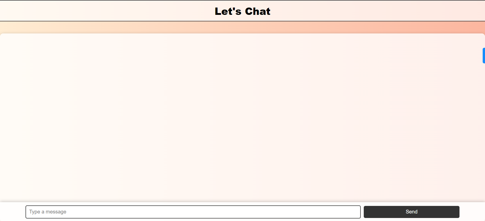
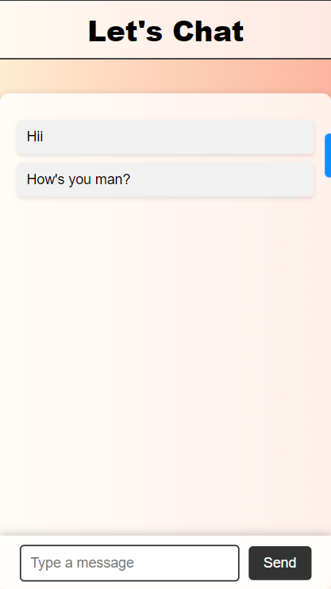
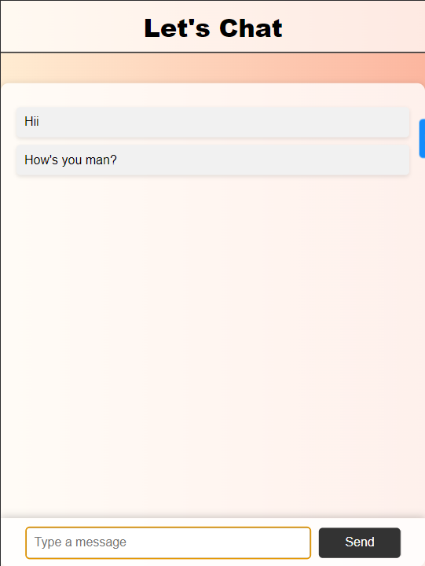

# Chat App

A simple web-based chat application using Socket.io for real-time communication.

## Features

- Real-time messaging
- Clean and responsive UI
- Easy to set up and run

## Technologies Used

- HTML
- CSS
- JavaScript
- Socket.io
- Node.js

## Installation

1. Clone the repository:

   ```
   git clone https://github.com/yourusername/chat-app.git
   cd chat-app
   ```

2. Install dependencies:

    ```
    npm install
    ```

3. Run the server:

    ```
    node index.js
    ```

4. pen your browser and navigate to:

    ```
    http://localhost:9000
    ```

## Usage
* Type a message in the input field and click the "Send" button or press "Enter" to send a message.
* Messages will appear in the chat window in real time.


## File Structure  

      chat-app/
    ├── public/
    │   ├── index.html
    │   ├── style.css
    │   └── socket.io.js
    ├── index.js
    ├── package.json
    └── README.md


## Screenshots

 


## Contributing
Contributions are welcome! Please fork the repository and submit a pull request.

## License
This project is licensed under the MIT License.

## Acknowledgements
* [Socket.io](https://socket.io/)
* [Node.js](https://nodejs.org/en)
